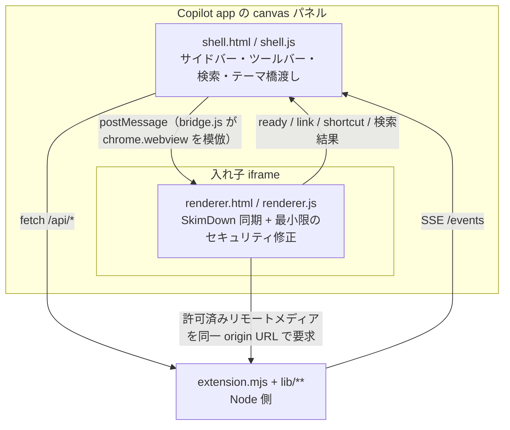

# AGENTS.md

このリポジトリは AI エージェントが開発することを前提にしている。この文書は、その
エージェントが変更を加えるときに必要な情報をまとめたものである。利用者向けの説明は
[README.md](README.md) にあり、この文書には持ち込まない。

## ドキュメントの役割分担

| 文書 | 役割 |
| --- | --- |
| [README.md](README.md) | 利用者向け。インストール、使い方、canvas アクション、UI の挙動、保存先 |
| `AGENTS.md`（この文書） | 開発向け。リポジトリ構成、検証コマンド、更新手順、レビューとリリースの運用 |
| [docs/architecture.md](docs/architecture.md) | 現在の設計。責務、信頼境界、保存モデル、実装者が守る不変条件 |
| [docs/adr/](docs/adr/README.md) | アーキテクチャ判断の履歴。現状説明の代わりにしない |
| コード | 関数、データ形式、分岐、UI 挙動の正 |

設計上の制約を確認するときは `docs/architecture.md` を読む。この文書へ設計詳細を
複製しない。

## リポジトリ構成

| パス | 内容 |
| --- | --- |
| `.github/extensions/skimdown/` | canvas 拡張の本体。checkout 後に実行されるコード |
| `.github/extensions/skimdown/extension.mjs` | canvas の登録、インスタンスのライフサイクル、アクション受付 |
| `.github/extensions/skimdown/lib/` | loopback サーバー、ソース解決、Markdown 走査、セッション文書、設定、ファイル監視、診断、リモートコンテンツ |
| `.github/extensions/skimdown/web/` | シェル（`shell.*`）、renderer（`renderer.*`）、ホスト互換シム（`bridge.js`）、`skimdown.css` |
| `.github/extensions/skimdown/web/vendor/` | vendored 実行資産。手で編集しない。インストーラーの 1 ファイル上限を超えるものは `<ファイル名>.NNN` のチャンクとして保管する |
| `.github/extensions/skimdown/scripts/vendor-assets.mjs` | vendored 資産の `refresh` / `sbom` / `verify` / `restore` |
| `.github/extensions/skimdown/test/` | 拡張プロセス側のテスト |
| `.github/extensions/skimdown/vendor-lock.json` | 取得元とファイル単位の SHA-256 |
| `.github/extensions/skimdown/vendor-sbom.cdx.json` | 生成された CycloneDX SBOM |
| `.github/extensions/skimdown/THIRD-PARTY-NOTICES.md` | 同梱 OSS のライセンス表記 |
| `scripts/verify-release-assets.mjs` | 同梱した KaTeX フォントの検証 |
| `scripts/katex-0.16.22-fonts.sha256` | 検証に使う SHA-256 |
| `test/` | web 資産（renderer、シェル、DOMPurify、UI 言語）のテスト |
| `.github/workflows/` | vendored 資産の検証（`verify-vendored-assets.yml`）とリリース（`release-extension.yml`） |
| `.github/CODEOWNERS` | code owner |
| `docs/` | 現在の設計と ADR |

## 開発環境

- Node.js のバージョンは `package.json` の `engines`（`^20.19.0 || ^22.13.0 || >=24.0.0`）に従う。CI は Node 20 を使う。
- 依存は `npm ci` で導入する。実行時依存はなく、devDependency は `jsdom` だけである。
- 拡張にビルド手順はない。`.github/extensions/skimdown/` のファイルがそのまま読み込まれて実行される。

## 検証コマンド

変更後は、影響範囲に応じて次を実行する。

```console
npm ci
npm test
```

`npm test` は Node のテストランナーで `test/*.test.mjs` と
`.github/extensions/skimdown/test/*.test.mjs` を実行する。

同梱資産に触れた場合は次も実行する。

```console
node scripts/verify-release-assets.mjs
node .github/extensions/skimdown/scripts/vendor-assets.mjs verify --source
```

`verify-release-assets.mjs` は、同梱した KaTeX フォントが公式 `v0.16.22` タグの配布物と
一致し、Git のテキスト変換対象になっていないことを確認する。`verify --source` は
repository 内の byte 列と `vendor-lock.json` に固定した取得元の両方を検証するため、
ネットワークへアクセスする。

## 実装時に守ること

不変条件の一覧は [docs/architecture.md](docs/architecture.md) の「実装者が守る不変条件」を
正とする。特に踏みやすい点を挙げる。

- 拡張プロセスの stdout は JSON-RPC 専用である。`console.log` を使わず、ホストのログ経路か診断成果物を使う。
- loopback サーバーはシェル、renderer、コンテンツの 3 origin を分離する。renderer origin に状態 API やシェル資産を置かない。
- コンテンツ origin は、選択文書の許可された範囲とメディア種別を越えてファイルを配信しない。
- `open()` は冪等に保つ。再接続時の再実行でサーバー、監視、購読を重複させない。
- 永続状態を `instanceId` で引かない。セッションは `sessionId`、文書はファイルパスまたはセッション内の安定 ID、設定はユーザースコープで識別する。
- 実行時状態と診断でユーザーの worktree を汚さない。
- テーマはホストトークンへ追従させ、独自の常用パレットを持たない。
- 各 origin の CSP は `default-src 'none'` を基点にし、新しい資源や接続先を暗黙に許可しない。renderer の CSP は外部 origin を許可せず、`img-src` / `media-src` は renderer / content origin と `data:` / `blob:` に限定し、`connect-src` は `'none'` にする。
- 同梱物のファイルは、拡張インストーラーの 1 ファイル上限（1,000,000 バイト）を超えない。超える vendored 資産はチャンクとして保管し、renderer origin が結合して配信する。チャンクを個別に配信しない。
- シェル origin の API と SSE は、インスタンス capability と同一 origin のブラウザー要求を必須にする。
- 診断へ Markdown 本文、URL、user agent、workspace / session 情報を記録しない。
- セッション本文とメタデータを、明示的な opt-in と有効期限なしに永続化しない。

これらを変える必要があるときは、コード変更より前か同じ変更の中で ADR を追加し、
`docs/architecture.md` を新しい現状へ更新する。

## 実装の全体像



移植の前提は、レンダラーを原則として上流から同期することである。`renderer.js` が
ホストへ触るのは `window.chrome.webview` の 2 か所だけだったため、`bridge.js` がそれを
`postMessage` の上に再実装している。`skimdown.css` と `web/vendor/**` は
SkimDown for Windows からのバイト単位のコピーで、`renderer.html` の差分は
`<script src="bridge.js">` の 1 行だけである。`renderer.js` も同じ同期モデルに従うが、
安全な上流リビジョンを待てない脆弱性については、回帰テスト付きの最小限のローカル修正を
許可し、上流へ反映された時点で再同期する。

ローカル HTTP サーバーは、信頼済みシェル、信頼されない renderer、ローカル画像用コンテンツの
3 つの loopback origin を分離する。本文中の相対画像はコンテンツ origin からのみ、しかも
開いているディレクトリ配下からのみ配信する。リモート画像とメディアは既定で無効にし、
文書単位で許可された場合だけ、renderer origin の proxy が公開 IP に限定して取得する。
状態 API と SSE は canvas インスタンスごとの一時的な capability で認証し、同一 origin の
ブラウザー要求だけを受け付ける。ファイル選択は workspace、セッション文書、または明示的に
開いたルートの内側に限定する。

テーマはアプリのトークン（`--background-color-default` など）を読み取り、SkimDown の
カスタムテーマ機構（`--skim-*`）へ写して渡す。アプリのテーマ変更は `MutationObserver` で
検知して追従する。

## 拡張の信頼モデル

`.github/extensions/**` は checkout 後に実行されるコードである。このパス配下の変更は、
文書に見える JavaScript、CSS、HTML、vendored ファイルを含めて、すべてコード変更として扱う。
レビューされていない外部 pull request の拡張を、資格情報や非公開リポジトリへアクセスできる
環境でインストールしたり実行したりしない。

`main` ブランチは、pull request、`Verify vendored assets` ステータスチェック、
`.github/CODEOWNERS` の owner による承認を必須にする。リポジトリ管理者は次も有効にする。

- 1 件以上の承認レビューと code owner レビュー
- 古い承認の破棄と、最新 push 後の承認
- マージ前の会話解決
- force push とブランチ削除の禁止

これらの設定はリポジトリ内のファイルからは構成されない。ブランチ保護または ruleset を
この節に合わせて維持するのはリポジトリ owner の責任である。

## 外部 pull request のレビュー

1. workflow を実行する前に、`.github/workflows/**`、`.github/actions/**`、
   `.github/extensions/**` の変更を確認する。
2. リポジトリまたは environment の secret を fork の workflow へ渡さない。このリポジトリの
   検証 workflow は contents 読み取り専用の権限で動作し、secret を使わない。
3. action の参照が完全な commit SHA に固定されたままであることを確認する。
4. vendored の変更では、immutable な取得元、更新されたコンポーネント情報、範囲を絞った差分、
   `Verify vendored assets` の成功を必須にする。
5. 実行コードの差分が code owner の承認を得てから、checkout やインストールを行う。

## vendored 資産の更新

vendored ファイルは `vendor-lock.json` に固定した取得元からバイト単位で再構成する。
多くは SkimDown for Windows の commit に由来する。範囲を絞ったセキュリティ更新では、
個別ファイルを依存物の immutable な上流 commit へ固定してもよい。`web/vendor/**` を
手で編集しない。

拡張インストーラーの 1 ファイル上限を超える資産は、`vendor-lock.json` の `chunks`
（チャンク長と各チャンクの SHA-256）で分割保管を宣言する。on-disk のチャンクは
`<ファイル名>.NNN`（3 桁 0 埋め）で、`refresh` / `restore` が上流バイト列から生成し、
`verify` が各チャンクと結合後のハッシュを検証する。配信時の結合は拡張側が行うため、
`renderer.html` の参照は上流のまま変えない。

1. 上流 SkimDown for Windows の commit をレビューし、40 文字の完全な SHA を控える。
   個別に更新するファイルは、公式リリースをレビューし、そのファイルの `source` に
   immutable な上流 commit URL を固定する。
2. リポジトリルートで次を実行する。

   ```console
   node .github/extensions/skimdown/scripts/vendor-assets.mjs refresh <commit-sha>
   ```

3. `vendor-lock.json` のコンポーネントのバージョン、ライセンス、homepage、package URL、purl を
   更新する。コンポーネント情報が変わった場合は `THIRD-PARTY-NOTICES.md` も更新する。
4. メタデータだけを変更した場合は SBOM を再生成する。

   ```console
   node .github/extensions/skimdown/scripts/vendor-assets.mjs sbom
   ```

5. 変更された資産をすべて確認し、作業ツリーと固定した取得元の両方を検証する。

   ```console
   node .github/extensions/skimdown/scripts/vendor-assets.mjs verify --source
   ```

バージョンやハッシュを変えずに、固定済みの byte 列へ戻すには次を実行する。

```console
node .github/extensions/skimdown/scripts/vendor-assets.mjs restore
```

`vendor-lock.json` は byte 単位の資産目録、`vendor-sbom.cdx.json` は生成された
CycloneDX の依存物目録である。どちらも更新時にレビューして commit する。

## リリース手順

リリースは `v1.0.0` のようなセマンティックバージョンのタグを使う。リリースタグは、
必須チェックがすべて通った `main` 上のレビュー済み commit を指す。

1. 対象の commit が `main` にあり、vendored 資産の検証が通っていることを確認する。
2. 新しい注釈付きタグを作成して push する。公開済みのタグを移動または再利用しない。

   ```console
   git tag -a v1.0.0 -m "SkimDown v1.0.0"
   git push origin v1.0.0
   ```

3. `Release extension` workflow がテストと整合性チェックを実行し、
   `.github/extensions/skimdown` ディレクトリ全体を `skimdown-<version>.zip` として梱包し、
   SHA-256 チェックサムを書き出して GitHub Release を作成する。
4. リリース資産を確認し、公開インストール URL には immutable なタグを使う。

   ```text
   https://github.com/runceel/SkimDownForGitHubCopilotApp/tree/v1.0.0/.github/extensions/skimdown
   ```

公開済みリリースを訂正する必要がある場合は、タグや資産を差し替えず、新しいパッチバージョンを
作成する。

## ADR の運用

ADR の運用規則と索引は [docs/adr/README.md](docs/adr/README.md) を正とする。次のいずれかに
該当し、複数の実装箇所へ制約を与える判断は ADR にする。

- コンポーネントの責務や依存方向
- 信頼境界、origin、権限、データの隔離
- ライフサイクル、同一性、永続化スコープ
- 外部または上流コンポーネントとの互換方針
- 可用性、可観測性、運用上の不変条件
- 後から覆すコストが高く、代替案とトレードオフを共有すべき判断

局所的なリファクタリング、関数や型の設計、UI の細かな挙動、単独のバグ修正、ライブラリの
通常更新は ADR にしない。ADR を追加・変更した変更セットでは、`docs/architecture.md` の
現状記述も更新する。
