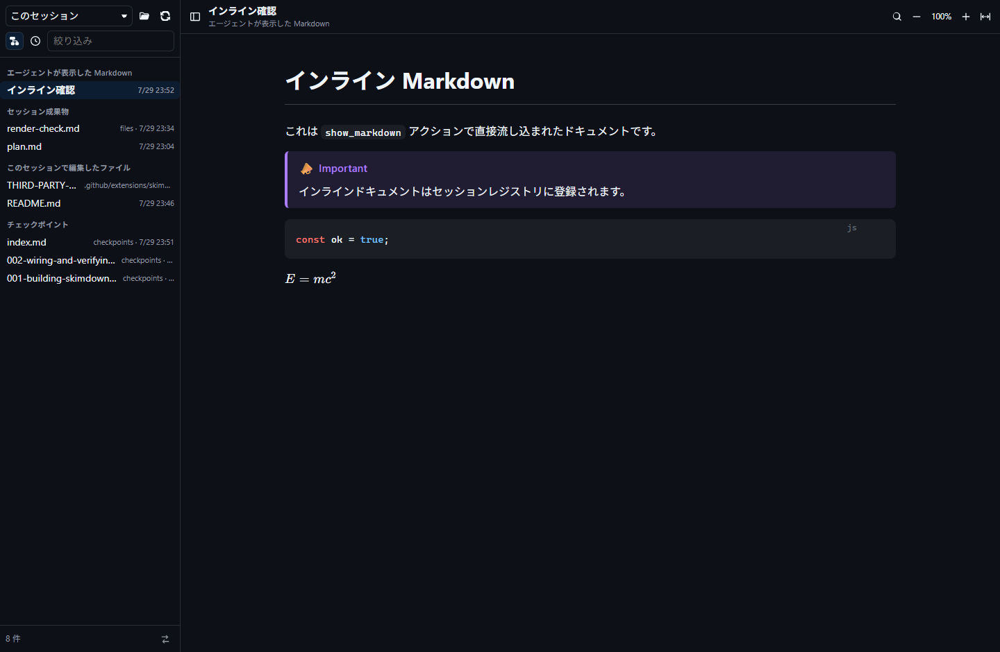
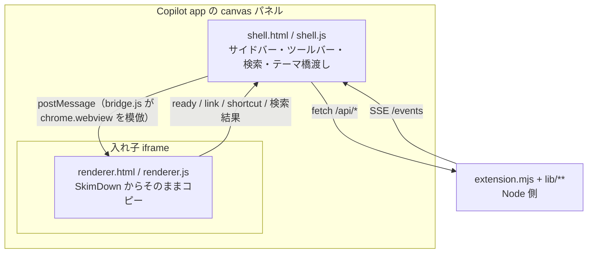

# SkimDown for GitHub Copilot App

[SkimDown for Windows](https://github.com/runceel/SkimDownForWindows)（WinUI 3 + WebView2 の
落ち着いた Markdown リーダー）の読書体験を、**GitHub Copilot app の extension canvas** に移植したものです。

用途を 2 つに絞っています。

1. **そのセッションで生成された Markdown を読む** — 成果物、エージェントが書いた `.md`、チャットから直接流し込まれたテキスト
2. **既存の Markdown を読む** — ワークスペース配下、または任意のファイル / フォルダー

## 使い方

拡張はこのリポジトリの `.github/extensions/skimdown/` に入っているので、
このリポジトリをプロジェクトとして開けば自動で読み込まれます。あとはエージェントに頼むだけです。

- 「SkimDown で `docs/architecture.md` を開いて」
- 「このセッションで作った Markdown を SkimDown で見せて」
- 「今の設計案を SkimDown で表示して」（ファイルを作らずにその場で描画）

他のリポジトリでも使いたい場合は、`install_extension` にこのリポジトリの
`.github/extensions/skimdown` フォルダー URL を渡してユーザースコープに入れてください。
vendor アセットが 4MB を超えるため、gist 経由の共有はできません。

## Canvas アクション

| アクション | 入力 | 動作 |
| --- | --- | --- |
| `show_markdown` | `markdown`, `title?`, `id?` | ファイルを作らずに Markdown を描画する。`id` を渡すと同じドキュメントを上書き更新する |
| `open_path` | `path` | ファイルなら単体表示、フォルダーならツリーのルートにする |
| `open_session` | — | 「このセッション」ソースに切り替える |
| `refresh` | — | 現在のソースを再スキャンする |
| `list_files` | `source?` | ドキュメント一覧を返す。`source` を渡すと表示を変えずにそのソースを一覧できる |
| `get_state` | — | 現在のソース / ルート / 選択中ドキュメントを返す |

`open_canvas` の入力（`path` / `markdown` / `title` / `id` / `source`）で初期表示も指定できます。

## ソース

サイドバー上部のセレクターで 3 つのソースを切り替えます。

| ソース | 中身 |
| --- | --- |
| **このセッション** | セッション成果物（`plan.md` と `files/**`）、エージェントが編集した `.md`、`show_markdown` で流し込まれたドキュメント、チェックポイント。グループ見出し付きの新しい順リスト |
| **ワークスペース** | 開いているリポジトリ配下を SkimDown と同じツリーで表示。`session.workspacePath` がセッション作業ディレクトリを指す場合でも、最寄りの git リポジトリを自動で見つけます |
| **パスを開く** | `open_path` や `open_canvas` の `input.path` で指定した任意のファイル / フォルダー |

Markdown の探索ルールは SkimDown for Windows の `MarkdownScanner` と同じです。
`.md` / `.markdown` を対象にし、`.git` / `node_modules` / `.build` / `DerivedData` と
ドット始まりの名前はどの深さでも除外します。

## 操作

| 操作 | 割り当て |
| --- | --- |
| 文書内検索 | `Ctrl+F`、`Enter` / `Shift+Enter` で移動、`Ctrl+E` で選択文字列を検索 |
| サイドバー開閉 | `Ctrl+B` |
| プライバシーと履歴 | サイドバー下部の盾ボタンから、保存、保持期間、消去を管理 |
| ズーム | `Ctrl+;` / `Ctrl+-` / `Ctrl+0`、ツールバーの `+` / `−` / `100%` |
| 本文の最大幅 | `Ctrl+[` / `Ctrl+]` |
| パスを開く | `Ctrl+O` |
| 全選択 | `Ctrl+A` |

Mermaid 図はクリックで拡大モーダルが開き、ホイールでズーム、ドラッグでパンできます。
コードブロックにはコピーボタンが付きます。開いているファイルはディスク上の変更を検知して自動で再読み込みされます。

外部リンクはいきなり開かず、URL を表示した確認バーが出ます。承認したものだけ OS の既定ブラウザに渡されます。

## 仕組み

移植の要点は、レンダラーを **一切書き換えない** ことです。
`renderer.js` がホストに触るのは `window.chrome.webview` の 2 箇所だけだったので、
`bridge.js` でそれを `postMessage` の上に再実装しました。
その結果 `renderer.js` / `skimdown.css` / `vendor/**` は SkimDown for Windows からバイト単位でコピーでき、
`renderer.html` の差分も `<script src="bridge.js">` の 1 行だけです。
SkimDown 側が改善されたら、それらのファイルを上書きコピーするだけで追従できます。

ローカルの HTTP サーバーは 2 本立てます。SkimDown が WebView2 で採っている
「アセット origin と コンテンツ origin を分ける」設計をそのまま踏襲したもので、
本文中の相対画像はコンテンツ側 origin からのみ、しかも開いているディレクトリ配下からのみ配信されます。

テーマはアプリのトークン（`--background-color-default` など）を読み取り、
SkimDown のカスタムテーマ機構（`--skim-*`）に写して渡します。
アプリのテーマが変わると `MutationObserver` が検知して即座に追従します。

## 状態の保存先

リポジトリには何も書きません。セッション履歴は既定では端末へ保存せず、
開いている拡張プロセスのメモリ内だけで保持します。

| スコープ | 場所 |
| --- | --- |
| ユーザー全体の設定 | `$COPILOT_HOME/extensions/skimdown/artifacts/settings.json` |
| セッションごとの履歴（保存を有効にした場合のみ） | `$COPILOT_HOME/extensions/skimdown/artifacts/sessions/<sessionId>.json` |

保存対象は、`show_markdown` で受け取った本文（最大 50 文書、各 2 MB）、このセッションで
編集した Markdown のパス、最後の選択とルートです。保持期間は 1 日、7 日、30 日から選択でき、
期限切れデータは自動削除されます。盾ボタンから現在のセッション、または保存済みの全セッションを
直ちに消去できます。保存を無効にした場合も、保存済み履歴をすべて削除します。

`plan.md`、チェックポイント、`files/**` は GitHub Copilot app が管理するセッション成果物です。
SkimDown の履歴消去はこれらの原本を削除しません。

## ライセンス

同梱している OSS のライセンスは
[THIRD-PARTY-NOTICES.md](.github/extensions/skimdown/THIRD-PARTY-NOTICES.md) を参照してください。
