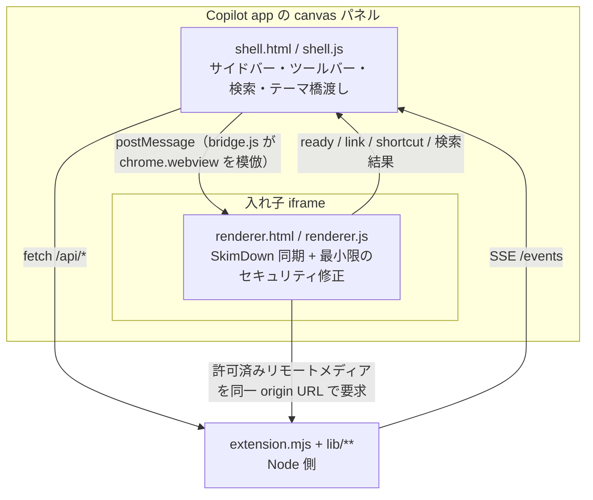

# SkimDown for GitHub Copilot App

[SkimDown for Windows](https://github.com/runceel/SkimDownForWindows)（WinUI 3 + WebView2 の
落ち着いた Markdown リーダー）の読書体験を、**GitHub Copilot app の extension canvas** に移植したものです。

用途を 2 つに絞っています。

1. **そのセッションで生成された Markdown を読む** — 成果物、エージェントが書いた `.md`、チャットから直接流し込まれたテキスト
2. **既存の Markdown を読む** — ワークスペース配下、または任意のファイル / フォルダー


## インストール

拡張はこのリポジトリの `.github/extensions/skimdown/` に入っているので、
このリポジトリをプロジェクトとして開けば自動で読み込まれます。あとはエージェントに頼むだけです。

他のリポジトリでも常に使えるようにするには、GitHub Copilot app で次のように依頼し、
公開リポジトリのフォルダー URL からユーザースコープへインストールします。

> 次の GitHub リポジトリフォルダーから SkimDown をユーザースコープへインストールしてください。
>
> `https://github.com/runceel/SkimDownForGitHubCopilotApp/tree/main/.github/extensions/skimdown`

`main` の URL は常に最新版を指します。再現可能なインストールには、リリース後に `main` を
バージョンタグへ置き換えた URL を使ってください。

```text
https://github.com/runceel/SkimDownForGitHubCopilotApp/tree/v1.0.0/.github/extensions/skimdown
```

リリースページには手動インストール用の ZIP と SHA-256 チェックサムも添付されます。
ZIP を展開すると、ユーザーの拡張ディレクトリへ配置できる `skimdown/` フォルダーになります。

拡張はローカルでコードを実行します。信頼できるタグまたはコミットを指定し、インストール前に
変更内容を確認してください。公開済みタグは移動せず、更新には新しいバージョンを使います。

## 使い方

- 「SkimDown で `docs/architecture.md` を開いて」
- 「このセッションで作った Markdown を SkimDown で見せて」
- 「今の設計案を SkimDown で表示して」（ファイルを作らずにその場で描画）

## Canvas アクション

| アクション | 入力 | 動作 |
| --- | --- | --- |
| `show_markdown` | `markdown`, `title?`, `id?` | ファイルを作らずに Markdown を描画する。`id` を渡すと同じドキュメントを上書き更新する |
| `open_path` | `path` | ファイルなら単体表示、フォルダーならツリーのルートにする |
| `open_session` | — | 「このセッション」ソースに切り替える |
| `refresh` | — | 現在のソースを再スキャンする |
| `list_files` | `source?` | ドキュメント一覧を返す。`source` を渡すと表示を変えずにそのソースを一覧できる |
| `get_state` | — | 現在のソース / ルート / 選択中ドキュメントを返す |

`open_canvas` の入力（`path` / `markdown` / `title` / `id` / `source`）で初期表示も指定できます。

## ソース

サイドバー上部のセレクターで 3 つのソースを切り替えます。

| ソース | 中身 |
| --- | --- |
| **このセッション** | セッション成果物（`plan.md` と `files/**`）、エージェントが編集した `.md`、`show_markdown` で流し込まれたドキュメント、チェックポイント。グループ見出し付きの新しい順リスト |
| **ワークスペース** | 開いているリポジトリ配下を SkimDown と同じツリーで表示。`session.workspacePath` がセッション作業ディレクトリを指す場合でも、最寄りの git リポジトリを自動で見つけます |
| **パスを開く** | `open_path` や `open_canvas` の `input.path` で指定した任意のファイル / フォルダー |

Markdown の探索ルールは SkimDown for Windows の `MarkdownScanner` と同じです。
`.md` / `.markdown` を対象にし、`.git` / `node_modules` / `.build` / `DerivedData` と
ドット始まりの名前はどの深さでも除外します。

## 操作

| 操作 | 割り当て |
| --- | --- |
| 文書内検索 | `Ctrl+F`、`Enter` / `Shift+Enter` で移動、`Ctrl+E` で選択文字列を検索 |
| サイドバー開閉 | `Ctrl+B` |
| プライバシーと履歴 | サイドバー下部の盾ボタンから、保存、保持期間、消去を管理 |
| ズーム | `Ctrl+;` / `Ctrl+-` / `Ctrl+0`、ツールバーの `+` / `−` / `100%` |
| 本文の最大幅 | `Ctrl+[` / `Ctrl+]` |
| パスを開く | `Ctrl+O` |
| 既定ブラウザーで表示 | ツールバーの外部表示ボタン |
| 全選択 | `Ctrl+A` |

Mermaid 図はクリックで拡大モーダルが開き、ホイールでズーム、ドラッグでパンできます。
コードブロックにはコピーボタンが付きます。開いているファイルはディスク上の変更を検知して自動で再読み込みされます。
ブラウザー表示は元の canvas と同じ状態と更新を共有し、canvas を閉じると接続も終了します。

外部リンクはいきなり開かず、URL を表示した確認バーが出ます。承認したものだけ OS の既定ブラウザに渡されます。

## リモートコンテンツとプライバシー

Markdown 内の HTTP(S) 画像・メディアは**既定で読み込みません**。文書にリモート参照があると確認バーが表示され、
「この文書で読み込む」を選んだ場合だけ読み込みます。許可は表示中の文書の現在の内容にだけ適用され、
文書の内容が変わると再確認が必要です。全体を常時許可する設定はありません。

許可後もブラウザーから参照先へ直接接続せず、SkimDown の loopback サーバーを経由します。リクエストは
`Referrer-Policy: no-referrer` で処理し、リダイレクト先を含めて DNS 解決結果を検査します。次の宛先は
許可後も読み込みません。

- loopback、link-local、プライベート / unique-local IP
- 単一ラベルの intranet ホスト名と `.local` / `.internal` / `.home` / `.lan`
- 画像・音声・動画以外の応答、20 MB を超える応答

renderer の CSP は外部 origin を許可せず、`img-src` / `media-src` は renderer/content origin と
`data:` / `blob:`（必要な種別のみ）に限定し、`connect-src` は `'none'` にしています。

## 仕組み



移植の要点は、レンダラーを原則として上流から同期することです。
`renderer.js` がホストに触るのは `window.chrome.webview` の 2 箇所だけだったので、
`bridge.js` でそれを `postMessage` の上に再実装しました。
`skimdown.css` / `vendor/**` は SkimDown for Windows からバイト単位でコピーし、
`renderer.html` の差分も `<script src="bridge.js">` の 1 行だけです。`renderer.js` も同じ
同期モデルを使いますが、安全な上流リビジョンが未提供の脆弱性については、回帰テスト付きの
最小限のローカル修正を許可し、上流へ反映された時点で再同期します。

ローカル HTTP サーバーは、信頼済み shell、信頼されない renderer、ローカル画像用 content の
3 つの loopback origin に分離します。本文中の相対画像は content origin からのみ、しかも開いている
ディレクトリ配下からのみ配信されます。リモート画像・メディアは既定で無効化し、文書単位で許可した場合だけ、
renderer origin の proxy が公開 IP に限定して取得します。
状態 API と SSE は canvas インスタンスごとの一時的な capability で認証し、同一 origin の
ブラウザー要求だけを受け付けます。ファイル選択も workspace、セッション文書、または明示的に
開いたルートの内側に限定されます。

テーマはアプリのトークン（`--background-color-default` など）を読み取り、
SkimDown のカスタムテーマ機構（`--skim-*`）に写して渡します。
アプリのテーマが変わると `MutationObserver` が検知して即座に追従します。

## リリース整合性

公開前に、同梱した KaTeX フォントが公式 `v0.16.22` タグの配布物と一致し、
Git のテキスト変換対象になっていないことを確認します。

```powershell
node scripts/verify-release-assets.mjs
```

検証用 SHA-256 は `scripts/katex-0.16.22-fonts.sha256` に固定しています。
vendor アセットを更新する場合は、取得元のタグとコミットを確認してから、
フォント本体とマニフェストを同時に更新してください。

## 状態の保存先

リポジトリには何も書きません。セッション履歴は既定では端末へ保存せず、
開いている拡張プロセスのメモリ内だけで保持します。

| スコープ | 場所 |
| --- | --- |
| ユーザー全体の設定 | `$COPILOT_HOME/extensions/skimdown/artifacts/settings.json` |
| セッションごとの履歴（保存を有効にした場合のみ） | `$COPILOT_HOME/extensions/skimdown/artifacts/sessions/<sessionId>.json` |

保存対象は、`show_markdown` で受け取った本文（最大 50 文書、各 2 MB）、このセッションで
編集した Markdown のパス、最後の選択とルートです。保持期間は 1 日、7 日、30 日から選択でき、
期限切れデータは自動削除されます。盾ボタンから現在のセッション、または保存済みの全セッションを
直ちに消去できます。保存を無効にした場合も、保存済み履歴をすべて削除します。

`plan.md`、チェックポイント、`files/**` は GitHub Copilot app が管理するセッション成果物です。
SkimDown の履歴消去はこれらの原本を削除しません。

## ライセンス

SkimDown for GitHub Copilot App は [MIT License](LICENSE) で公開しています。

同梱している OSS のライセンスは
[THIRD-PARTY-NOTICES.md](.github/extensions/skimdown/THIRD-PARTY-NOTICES.md) を参照してください。

## Supply chain

vendored 資産は、固定した SkimDown for Windows の commit とファイル単位の SHA-256 に対して
CI で検証します。依存物一覧は
[`vendor-lock.json`](.github/extensions/skimdown/vendor-lock.json) と
[`vendor-sbom.cdx.json`](.github/extensions/skimdown/vendor-sbom.cdx.json) に記録します。
更新手順、外部 pull request の確認手順、branch protection の必須設定は
[CONTRIBUTING.md](CONTRIBUTING.md) を参照してください。
