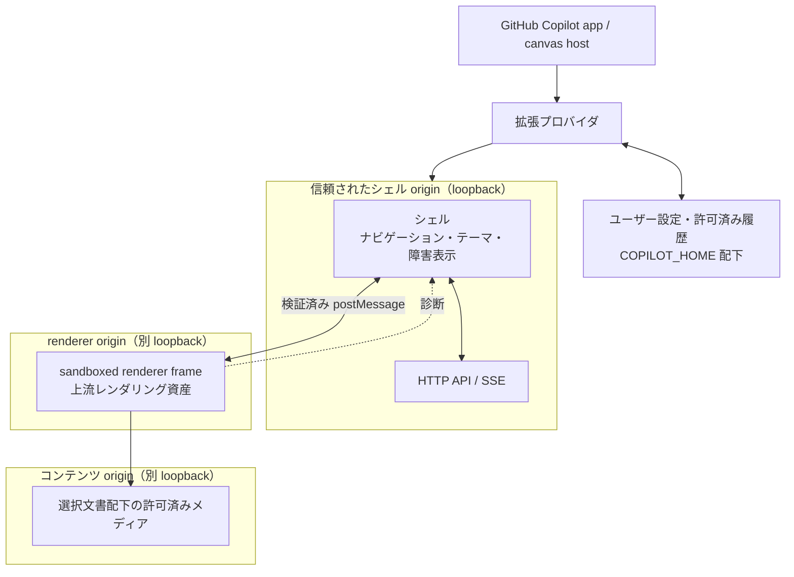

# SkimDown canvas 拡張のアーキテクチャ

この文書は SkimDown canvas 拡張の**現在の設計**を示す。判断の経緯は
[ADR](adr/README.md) に分離し、この文書には履歴を持ち込まない。

読者は、実装する要求仕様をすでに把握している開発者である。この文書の目的は、
その開発者が構造、境界、不変条件を守って実装できるようにすることにある。
個々の関数、データ形式、分岐、UI 操作の詳細はコードを正とする。

## 責務と非責務

この拡張は、GitHub Copilot app の canvas で Markdown を落ち着いて読むための
読み取り専用 UI である。対象は、現在のセッションで生成された Markdown と、
ユーザーが指定した既存の Markdown である。

次の責務は持たない。

- Markdown の編集や、リポジトリ内コンテンツの暗黙的な変更
- 任意の Web コンテンツを実行する汎用ブラウザー
- 上流 SkimDown のレンダリングエンジンを独自に再実装すること
- canvas パネルの寿命を越えて、パネルそのものを永続的に識別すること

## 全体構成

### コンポーネントと境界

| コンポーネント | 責務 | 境界 |
| --- | --- | --- |
| 拡張プロバイダ | canvas の登録、インスタンスのライフサイクル、ホストからのアクション受付 | UI の描画や Markdown の解釈を持たない |
| ローカル HTTP サーバー層 | UI 資産、renderer 資産、状態操作、イベント配信、ローカルメディアの限定配信 | loopback 外へ公開しない。シェル、renderer、コンテンツを同じ origin にしない |
| シェル | ナビゲーション、ツールバー、ホストテーマの取り込み、サーバーと renderer の仲介、障害表示 | Markdown のレンダリング規則を持たない |
| renderer frame | 上流 SkimDown と同じレンダリング処理で、信頼できない Markdown を安全な表示へ変換する | シェルの UI や永続化を持たない |
| ホスト互換シム | 上流 renderer が期待するホスト契約を canvas 環境へ適合させる | 上流 renderer を変更して差異を吸収しない |
| パス・保存先の解決層 | ワークスペース、セッション成果物、ユーザーグローバル状態の所在を分離する | 実行時状態でユーザーの worktree を汚さない |

## 信頼境界と origin

1 つの canvas インスタンスは、異なるポートを持つ 3 つの loopback origin を使う。

- **シェル origin** は、拡張が管理するシェル、状態 API、イベントストリームだけを提供する。
  ここは信頼されたアプリケーションコードと状態操作の領域であり、API とイベントストリームは
  インスタンス固有の capability を持つ同一 origin の要求だけを受け付ける。
- **renderer origin** は、renderer とベンダー資産だけを提供し、状態 API とシェル資産を
  提供しない。インストーラーの 1 ファイル上限を超える資産はチャンクとして保管され、
  この origin が結合して上流と同じバイト列を返す。チャンク自体は配信対象にしない。
- **コンテンツ origin** は、開いている文書から参照されるローカルメディアだけを提供する。
  配信対象は許可されたメディア種別かつ選択文書のディレクトリ配下に閉じ込める。

renderer frame はシェルと異なる origin に置き、sandbox 化する。シェルとの直接 DOM・
JavaScript アクセスを許可せず、許可したメッセージ契約だけを境界越しに通す。

renderer のコードは信頼された上流資産だが、入力される Markdown は信頼しない。
Markdown 由来の HTML は renderer のサニタイズ処理を経由し、ローカルメディアは
特権を持つシェル origin から配信しない。各 origin は役割別 CSP を HTTP header で配信し、
renderer からシェル API と未許可の外部資源へ接続できないようにする。
サニタイズは inert な DOM 上で完了させ、URL 解決を含む後処理にも未サニタイズの node を
渡さない。サニタイザーを利用できない場合は、Markdown を表示せず fail closed とする。

## ライフサイクル

canvas の `open()` は、初回にインスタンス固有の実行時資源を準備し、再オープンでは
既存資源を再利用して入力だけを適用する。ホストはプロバイダ再接続時に `open()` を
再実行し得るため、同じ `instanceId` に対する `open()` は冪等でなければならない。

プロバイダ再接続時の rehydrate では、パネルの一時的な URL やメモリ状態を永続的な
同一性として扱わない。ユーザーが期限付き履歴の保存を許可している場合だけ、その
セッション状態から表示対象を復元する。許可していない場合は新しい実行時文脈として開始する。
close 時には、イベント接続、ファイル監視、loopback サーバー、メモリ内履歴を
インスタンスとともに解放する。

## 同一性

| 対象 | 同一性 | 寿命 |
| --- | --- | --- |
| canvas パネル | `instanceId` | 開いているパネルとアクションのルーティングだけ |
| セッション状態 | ホストの `sessionId` | 同一セッション内の再接続と再オープン |
| ファイル文書 | 正規化されたファイルパス | そのパスにある文書 |
| インライン文書 | セッション内で安定した文書 ID | 同じ ID による更新と再表示 |
| ユーザー設定 | ユーザースコープ | リポジトリやセッションをまたぐ |

`instanceId` と文書の同一性を混同してはならない。`instanceId` はパネルの一時的な
識別子であり、永続状態のキーではない。

## 通信

- **canvas host と拡張プロバイダ**は、canvas の open、close、action 契約で通信する。
- **canvas UI と拡張プロセス**は、loopback HTTP で操作し、SSE で状態と文書の変更を受け取る。
  要求と継続的な更新を分離することで、ファイル変更や別経路の action を同じ表示へ反映する。
  インスタンス capability、loopback Host、Origin、Fetch Metadata をすべて検証し、状態変更は
  JSON 要求に限定する。capability はインスタンスと同じ寿命を持ち、永続化しない。
- **シェルと renderer**は、送信元 window、origin、封筒、メッセージ種別を検証する
  `postMessage` だけで通信する。通知を 1 回受信できたかではなく、シェルが準備状態を
  再問い合わせし、renderer が現在状態で応答して合意する。

renderer への配送は非同期性を保ち、上流ホスト契約と同じ順序・再入特性を維持する。
通信経路を変更するときは、上流互換性と再接続時の可用性を同時に評価する。

## 外部ブラウザーへの引き渡し

パネルは、同じインスタンスの表示を OS の既定ブラウザーで開き直せる。これは拡張プロセスが
自インスタンスのパネル URL を既定ブラウザーへ引き渡す操作であり、引き渡しを要求できる経路は
シェル UI と、ホスト経由の canvas アクション契約に限る。呼び出し側は起動先の URL、
ブラウザー、コマンドを指定できない。文書内リンクの外部起動は、URL を提示して承認を求める
別経路として維持する。

パネル URL はインスタンス capability を含むため、ホストの `open()` 戻り値以外の経路で
インスタンスの外へ出さない。アクションの戻り値、状態問い合わせ、ログ、診断に URL や
capability を含めない。外部ブラウザーの表示は同じインスタンスの状態とイベントを共有する
追加クライアントであり、独立した寿命を持たず、インスタンスの close とともに失効する。

## 保存モデル

実行時状態はリポジトリへ書かない。

| スコープ | 内容 | 保存先 |
| --- | --- | --- |
| ユーザーグローバル | 読書 UI の設定、上限付き診断 | `$COPILOT_HOME/extensions/skimdown/artifacts/` |
| 実行中セッション | インライン文書、セッション中に扱った文書、最後の選択 | 拡張プロセスのメモリ。既定では永続化しない |
| 許可済みセッション履歴 | 同じセッション文脈の復元に必要な本文とメタデータ | ユーザーが保存を明示的に有効化した場合だけ、同 artifacts 配下の `sessionId` 単位の領域 |
| ホスト管理セッション | plan、チェックポイント、セッション成果物 | `$COPILOT_HOME/session-state/<sessionId>/`。拡張は読み手として扱う |
| リポジトリ | ユーザーが管理する Markdown | 明示的な編集要求がない限り読み取り専用 |

ユーザー設定はセッションを越えて共有し、セッション文書は別セッションへ漏らさない。
履歴の永続化は opt-in とし、すべての永続履歴にユーザーが選んだ上限付き保持期間を適用する。
期限切れ、旧形式、破損した履歴は自動削除し、ユーザーは現在のセッションまたは保存済み履歴
全体を明示的に消去できる。保存を無効化したときも永続履歴を残さない。
履歴の消去は、ホスト管理セッション成果物やリポジトリ内 Markdown の原本へ波及させない。
ホストが報告する workspace path は session-state 領域を指す場合があるため、それを
リポジトリルートと仮定しない。workspace の読書対象とホスト管理成果物の所在を別々に解決する。
永続化は原子的に行い、破損や欠落は UI 全体の起動失敗へ広げない。

## テーマ

ホストが提供するテーマトークンを色とコントラストの唯一の基準とする。シェルはブラウザーが
解決したホストトークンを上流 renderer のテーマ契約へ変換し、ホストのテーマ変更へ追従する。
拡張独自の常用パレットを持ってはならない。フォールバック色は、トークンが利用できない場合に
可読性を守る安全弁に限る。

## 可観測性

renderer frame の実行状態は、拡張プロセスから直接観察できない。一方、拡張の通常ログは
ephemeral であり、再接続後の調査には残らない。

そのため、renderer とシェルが起動初期から自身の状態とエラーを収集する。renderer の診断は
検証済みメッセージでシェルへ渡し、シェル origin の診断経路を通じて拡張へ返す。
この経路はインスタンス固有の capability で認証し、
許可済み schema、body サイズ、受付頻度を越える入力を拒否する。診断は
`$COPILOT_HOME` 配下で byte 上限内に rotation され、成功時の経路と失敗理由の両方を
事後確認できるようにする。診断処理そのものの失敗は、読書 UI を停止させてはならない。
また、診断へ Markdown 本文、URL、user agent、workspace/session 情報を記録しない。

## 実装者が守る不変条件

1. `skimdown.css` と通常の `vendor/**` 更新は、採用した SkimDownForWindows の上流リビジョン
   からのバイト単位コピーとする。緊急の依存物修正は、公式 release の immutable な取得元を
   個別に固定してよい。vendored 実行資産は取得元、ファイル単位の SHA-256、依存コンポーネント
   情報で固定し、repository 内と固定取得元の両方に対して CI で検証する。
   `renderer.js` も上流同期を原則とするが、安全な上流リビジョンを
   待てない脆弱性には、回帰テスト付きの最小限のローカル hardening patch を許可する。
   上流へ修正が入った時点で差分を解消し、再び上流コピーへ戻す。
2. 同梱物のファイルは、拡張インストーラーの 1 ファイル上限を超えない。上限を超える vendored
   資産は、上流バイト列を固定長チャンクへ分割して保管し、renderer origin が要求時に結合して
   配信する。固定台帳はチャンク個別の SHA-256 と結合後の SHA-256 を持ち、検証では結合結果が
   上流取得元と一致することまで確認する。チャンクを個別に配信しない。
3. canvas の frame はすでに WebView2 内で動き、`window.chrome.webview` はホストに
   占有されている。素の代入は strict mode で `TypeError` になり得るため、
   互換シムは既存プロパティを調査し、段階的フォールバックで導入する。
4. 拡張プロセスの stdout は JSON-RPC 専用である。拡張プロセスで `console.log` を使わず、
   ホストのログ経路または診断成果物を使う。
5. HTTP サーバーは loopback のみにバインドし、シェル、renderer、コンテンツの 3 origin を
   分離する。renderer origin に状態 API やシェル資産を置かない。
6. コンテンツ origin は、選択文書の許可された範囲とメディア種別を越えてファイルを配信しない。
7. `open()` は冪等に保つ。再接続時の open 再実行で、サーバー、監視、購読を重複させない。
8. 永続状態を `instanceId` で引かない。セッションは `sessionId`、文書はファイルパスまたは
   セッション内の安定 ID、設定はユーザースコープで識別する。
9. renderer の準備完了を単発通知の受信だけに依存させない。検証済みメッセージで現在状態を
   再問い合わせ可能にする。
10. 実行時状態と診断でユーザーの worktree を汚さない。
11. テーマはホストトークンへ追従し、独立した常用パレットを導入しない。
12. 各 origin の CSP は `default-src 'none'` を基点にし、新しい資源や接続先を暗黙に許可しない。
13. シェル origin の API と SSE は、インスタンス capability と同一 origin のブラウザー要求を
    必須にする。loopback bind や port 番号だけを認証として扱わない。
14. ローカルファイル操作は、workspace、セッションで登録された文書、または明示的に承認された
    root の内側に限定し、クライアントが送るパスをそのまま信頼しない。
15. 診断 API は schema、body サイズ、受付頻度、保存総量の境界を外さない。
16. セッション本文とそのメタデータを、明示的な opt-in と有効期限なしに永続化しない。
    opt-out、期限切れ、明示的な消去を、成功に見せかけず保存層へ反映する。
17. 外部ブラウザーへの引き渡しは、自インスタンスのパネル URL を OS の既定ブラウザーへ渡す
    操作に限定する。呼び出し側から URL やブラウザーを受け取らず、capability を含む URL を
    ホストの `open()` 戻り値以外の経路へ出さない。

これらを変更する必要がある場合は、コード変更より先に、または同じ変更の中で ADR を追加し、
この文書を新しい現状へ更新する。
