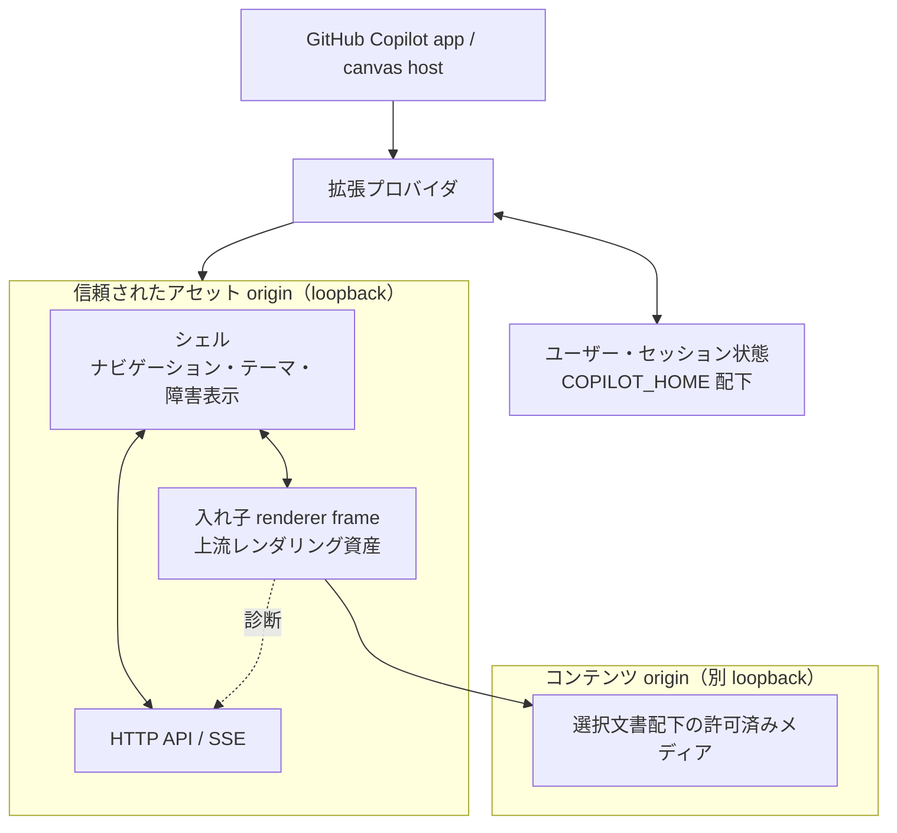

# SkimDown canvas 拡張のアーキテクチャ

この文書は SkimDown canvas 拡張の**現在の設計**を示す。判断の経緯は
[ADR](adr/README.md) に分離し、この文書には履歴を持ち込まない。

読者は、実装する要求仕様をすでに把握している開発者である。この文書の目的は、
その開発者が構造、境界、不変条件を守って実装できるようにすることにある。
個々の関数、データ形式、分岐、UI 操作の詳細はコードを正とする。

## 責務と非責務

この拡張は、GitHub Copilot app の canvas で Markdown を落ち着いて読むための
読み取り専用 UI である。対象は、現在のセッションで生成された Markdown と、
ユーザーが指定した既存の Markdown である。

次の責務は持たない。

- Markdown の編集や、リポジトリ内コンテンツの暗黙的な変更
- 任意の Web コンテンツを実行する汎用ブラウザー
- 上流 SkimDown のレンダリングエンジンを独自に再実装すること
- canvas パネルの寿命を越えて、パネルそのものを永続的に識別すること

## 全体構成

### コンポーネントと境界

| コンポーネント | 責務 | 境界 |
| --- | --- | --- |
| 拡張プロバイダ | canvas の登録、インスタンスのライフサイクル、ホストからのアクション受付 | UI の描画や Markdown の解釈を持たない |
| ローカル HTTP サーバー層 | UI 資産、状態操作、イベント配信、ローカルメディアの限定配信 | loopback 外へ公開しない。アセットとコンテンツを同じ origin にしない |
| シェル | ナビゲーション、ツールバー、ホストテーマの取り込み、サーバーと renderer の仲介、障害表示 | Markdown のレンダリング規則を持たない |
| renderer frame | 上流 SkimDown と同じレンダリング処理で、信頼できない Markdown を安全な表示へ変換する | シェルの UI や永続化を持たない |
| ホスト互換シム | 上流 renderer が期待するホスト契約を canvas 環境へ適合させる | 上流 renderer を変更して差異を吸収しない |
| パス・保存先の解決層 | ワークスペース、セッション成果物、ユーザーグローバル状態の所在を分離する | 実行時状態でユーザーの worktree を汚さない |

## 信頼境界と origin

1 つの canvas インスタンスは、異なるポートを持つ 2 つの loopback origin を使う。

- **アセット origin** は、拡張が管理するシェル、renderer、ベンダー資産、状態 API、
  イベントストリームを提供する。ここは信頼されたアプリケーションコードの領域である。
- **コンテンツ origin** は、開いている文書から参照されるローカルメディアだけを提供する。
  配信対象は許可されたメディア種別かつ選択文書のディレクトリ配下に閉じ込める。

シェルと renderer frame は同一 origin である。入れ子 frame は責務と互換性の境界であり、
ブラウザー上のセキュリティ境界ではない。同一 origin は、両者が現在状態を直接確認できる
可用性上の前提でもある。

renderer のコードは信頼された上流資産だが、入力される Markdown は信頼しない。
Markdown 由来の HTML は renderer のサニタイズ処理を経由し、ローカルメディアは
特権を持つアセット origin から配信しない。この区別を崩してはならない。

## ライフサイクル

canvas の `open()` は、初回にインスタンス固有の実行時資源を準備し、再オープンでは
既存資源を再利用して入力だけを適用する。ホストはプロバイダ再接続時に `open()` を
再実行し得るため、同じ `instanceId` に対する `open()` は冪等でなければならない。

プロバイダ再接続時の rehydrate では、パネルの一時的な URL やメモリ状態を永続的な
同一性として扱わない。セッション状態から表示対象を復元し、新しい実行時資源へ
接続し直す。close 時には、イベント接続、ファイル監視、loopback サーバーを
インスタンスとともに解放する。

## 同一性

| 対象 | 同一性 | 寿命 |
| --- | --- | --- |
| canvas パネル | `instanceId` | 開いているパネルとアクションのルーティングだけ |
| セッション状態 | ホストの `sessionId` | 同一セッション内の再接続と再オープン |
| ファイル文書 | 正規化されたファイルパス | そのパスにある文書 |
| インライン文書 | セッション内で安定した文書 ID | 同じ ID による更新と再表示 |
| ユーザー設定 | ユーザースコープ | リポジトリやセッションをまたぐ |

`instanceId` と文書の同一性を混同してはならない。`instanceId` はパネルの一時的な
識別子であり、永続状態のキーではない。

## 通信

- **canvas host と拡張プロバイダ**は、canvas の open、close、action 契約で通信する。
- **canvas UI と拡張プロセス**は、loopback HTTP で操作し、SSE で状態と文書の変更を受け取る。
  要求と継続的な更新を分離することで、ファイル変更や別経路の action を同じ表示へ反映する。
- **シェルと renderer**は、同一 origin の直接問い合わせを主経路とする。通知を 1 回
  受信できたかどうかではなく、現在の準備状態を問い合わせて合意する。`postMessage` は、
  直接ハンドルを利用できない場合のフォールバックとして残す。

renderer への配送は非同期性を保ち、上流ホスト契約と同じ順序・再入特性を維持する。
通信経路を変更するときは、上流互換性と再接続時の可用性を同時に評価する。

## 保存モデル

実行時状態はリポジトリへ書かない。

| スコープ | 内容 | 保存先 |
| --- | --- | --- |
| ユーザーグローバル | 読書 UI の設定、上限付き診断 | `$COPILOT_HOME/extensions/skimdown/artifacts/` |
| セッション | インライン文書、セッション中に扱った文書、最後の選択 | 同 artifacts 配下の `sessionId` 単位の領域 |
| ホスト管理セッション | plan、チェックポイント、セッション成果物 | `$COPILOT_HOME/session-state/<sessionId>/`。拡張は読み手として扱う |
| リポジトリ | ユーザーが管理する Markdown | 明示的な編集要求がない限り読み取り専用 |

ユーザー設定はセッションを越えて共有し、セッション文書は別セッションへ漏らさない。
ホストが報告する workspace path は session-state 領域を指す場合があるため、それを
リポジトリルートと仮定しない。workspace の読書対象とホスト管理成果物の所在を別々に解決する。
永続化は原子的に行い、破損や欠落は UI 全体の起動失敗へ広げない。

## テーマ

ホストが提供するテーマトークンを色とコントラストの唯一の基準とする。シェルはブラウザーが
解決したホストトークンを上流 renderer のテーマ契約へ変換し、ホストのテーマ変更へ追従する。
拡張独自の常用パレットを持ってはならない。フォールバック色は、トークンが利用できない場合に
可読性を守る安全弁に限る。

## 可観測性

renderer frame の実行状態は、拡張プロセスから直接観察できない。一方、拡張の通常ログは
ephemeral であり、再接続後の調査には残らない。

そのため、renderer とシェルが起動初期から自身の状態とエラーを収集し、アセット origin の
診断経路を通じて拡張へ返す。診断は `$COPILOT_HOME` 配下の上限付き成果物へ残し、
成功時の経路と失敗理由の両方を事後確認できるようにする。診断処理そのものの失敗は、
読書 UI を停止させてはならない。また、診断へ Markdown 本文を記録しない。

## 実装者が守る不変条件

1. `renderer.js`、`skimdown.css`、`vendor/**` は、採用した
   SkimDownForWindows の上流リビジョンからのバイト単位コピーとする。手で編集しない。
   変更が必要なら上流を修正し、上流リビジョンを更新して再コピーする。vendored 実行資産は
   完全な上流 commit、ファイル単位の SHA-256、依存コンポーネント情報で固定し、
   repository 内と固定取得元の両方に対して CI で検証する。
2. canvas の frame はすでに WebView2 内で動き、`window.chrome.webview` はホストに
   占有されている。素の代入は strict mode で `TypeError` になり得るため、
   互換シムは既存プロパティを調査し、段階的フォールバックで導入する。
3. 拡張プロセスの stdout は JSON-RPC 専用である。拡張プロセスで `console.log` を使わず、
   ホストのログ経路または診断成果物を使う。
4. HTTP サーバーは loopback のみにバインドし、アセット origin とコンテンツ origin を
   分離する。
5. コンテンツ origin は、選択文書の許可された範囲とメディア種別を越えてファイルを配信しない。
6. `open()` は冪等に保つ。再接続時の open 再実行で、サーバー、監視、購読を重複させない。
7. 永続状態を `instanceId` で引かない。セッションは `sessionId`、文書はファイルパスまたは
   セッション内の安定 ID、設定はユーザースコープで識別する。
8. renderer の準備完了を単発通知の受信だけに依存させない。現在状態を問い合わせ可能にする。
9. 実行時状態と診断でユーザーの worktree を汚さない。
10. テーマはホストトークンへ追従し、独立した常用パレットを導入しない。

これらを変更する必要がある場合は、コード変更より先に、または同じ変更の中で ADR を追加し、
この文書を新しい現状へ更新する。
